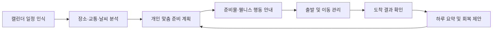

# 야르 비행단

<div align="center">

<!-- 대표 이미지가 준비되면 아래 주석을 해제하고 경로를 수정하세요. -->

<!--  -->

# Ensom

### 늦지 않게, 서두르지 않게.

**AI 웰니스 일정관리 비서**

일정과 이동 사이에서 사용자가 실제로 준비하고 움직이는 과정을 함께합니다.

<br>

[프로젝트 소개](#-project) ·
[핵심 기능](#-key-features) ·
[기술 스택](#-tech-stack) ·
[팀원 소개](#-team) ·
[프로젝트 문서](#-documentation)

</div>

---

## 🦁 About Team Ensom

**Ensom**은 프랑스어 `ensemble`, 즉 **함께**라는 의미에서 착안한 이름입니다.

저희는 단순히 정보를 보여주는 도구가 아니라, 사용자가 약속을 준비하고 이동하며 하루를 마무리하는 전 과정을 **함께 준비하는 서비스**를 만들고 있습니다.

Ensom 팀은 중앙톤의 웰니스 프로젝트를 위해 모인 명지대학교 자연캠퍼스 6인 팀으로, 기획·디자인, 프론트엔드, 백엔드, AI 파트가 협업하고 있습니다.

> 기술 자체보다 기술이 만들어내는 사용자의 경험 변화를 중요하게 생각합니다.

---

## 🌿 Project

### AI 웰니스 일정관리 비서, Ensom

Ensom은 캘린더의 다음 일정과 이동 경로, 교통, 날씨, 사용자의 실제 준비 패턴을 분석해 다음 행동을 먼저 제안합니다.

1. **언제부터 준비해야 하는가**
2. **언제 출발해야 하는가**
3. **무엇을 챙기거나 준비해야 하는가**
4. **외출 후 어떤 회복 행동이 필요한가**

기존 캘린더는 일정을 보여주고, 지도 앱은 출발 이후의 길을 안내합니다.

Ensom은 그 사이에 빠져 있던 **사용자의 실제 준비 과정**을 관리합니다.

> 지도 앱이 출발할 시간을 알려준다면,
> **Ensom은 준비를 시작할 시간을 알려줍니다.**

---

## 🔍 Problem

사용자는 외출 전에 여러 정보를 직접 확인하고 조합해야 합니다.

| 기존 사용자 경험       | 발생하는 문제                           |
| --------------- | --------------------------------- |
| 캘린더에서 일정 확인     | 일정만 알 수 있고 준비 시점은 알기 어려움          |
| 지도 앱에서 이동 시간 확인 | 이미 준비가 끝났다는 것을 전제로 출발 시각을 안내함     |
| 날씨 앱에서 환경 정보 확인 | 자외선·미세먼지·강수 정보를 실제 행동으로 다시 판단해야 함 |
| 준비시간을 감으로 계산    | 실제보다 짧게 예상해 촉박하게 움직이거나 지각함        |
| 준비물과 개인 루틴을 기억  | 우산, 약, 영양제, 충전기, 선크림 등을 놓칠 수 있음   |

사람들이 늦는 이유는 단순히 길을 모르기 때문만은 아닙니다.

**자신에게 필요한 준비 시간을 정확히 알지 못하고, 준비를 시작해야 할 시점을 놓치기 때문입니다.**

---

## 💡 Solution

Ensom은 사용자에게 무조건 더 일찍 움직이라고 요구하지 않습니다.

사용자가 처음 입력한 준비시간은 낮은 신뢰도의 초기값으로만 사용하고, 이후 실제 준비·출발·도착 기록을 바탕으로 계획을 지속적으로 조정합니다.



Ensom은 결과만 보고 준비시간을 무작정 늘리지 않습니다.

| 계획이 어긋난 원인        | Ensom의 조정 방식          |
| ----------------- | --------------------- |
| 준비를 늦게 시작함        | 준비시간은 유지하고 알림 시점을 앞당김 |
| 준비가 예상보다 오래 걸림    | 예상 준비시간을 조정함          |
| 준비 후 출발이 늦음       | 출발 전 여유시간을 추가함        |
| 제시간에 출발했지만 늦게 도착함 | 교통 버퍼를 조정함            |
| 사고·폭우 등 돌발 상황     | 이상치로 분류해 낮은 가중치로 반영함  |
| 반복적으로 너무 일찍 도착함   | 과도한 도착 여유를 점진적으로 줄임   |

---

## ✨ Key Features

### 1. 일정 자동 인식

캘린더의 일정 시간과 장소를 확인하고 이동이 필요한 일정인지 구분합니다.

* 오프라인 일정
* 온라인 일정
* 장소가 아직 정해지지 않은 일정
* 사용자가 직접 관리에서 제외한 일정

자동 판단이 불확실하면 임의로 결정하지 않고 사용자에게 한 번만 확인합니다.

### 2. 개인 맞춤 준비 계획

일정 시작 시각부터 역산해 준비 시작 시각을 계산합니다.

```text
목표 도착 시각
= 일정 시작 시각 - 도착 여유 시간

권장 출발 시각
= 목표 도착 시각 - 예상 이동 시간 - 교통 버퍼

준비 시작 시각
= 권장 출발 시각 - 개인 준비 시간 - 추가 준비 시간
```

실제 행동 기록이 쌓일수록 일정 유형, 시간대, 날씨와 장소에 맞는 계획으로 조정됩니다.

### 3. 나만의 준비 항목

사용자는 외출 전에 반복적으로 챙기거나 수행하는 항목을 등록할 수 있습니다.

* 영양제와 사용자가 등록한 복용약
* 물과 텀블러
* 선크림과 마스크
* 우산과 겉옷
* 노트북과 충전기
* 학생증·사원증·출입증
* 화장·헤어·샤워 등 시간이 필요한 루틴
* 반려동물 돌보기
* 개인 기호 품목과 사용자 정의 항목

단순 준비물은 체크리스트에 반영하고, 시간이 필요한 루틴은 준비시간 계산에도 반영합니다.

### 4. 상황 기반 웰니스 안내

Ensom은 날씨 정보를 보여주는 것에 그치지 않고, 사용자가 바로 실행할 수 있는 행동으로 변환합니다.

| 환경 조건   | 행동 제안 예시              |
| ------- | --------------------- |
| 강수      | 우산과 방수 준비, 추가 이동시간 반영 |
| 높은 자외선  | 선크림·모자·양산 확인          |
| 미세먼지    | 마스크 확인과 야외 노출 안내      |
| 큰 일교차   | 겉옷 준비                 |
| 폭염      | 물과 수분 보충 준비           |
| 긴 야외 이동 | 사용자 설정에 따른 선크림 재확인 알림 |

웰니스 기능은 의료 진단이나 치료를 제공하지 않으며, 사용자가 선택한 범위 안에서 일반적인 준비와 회복 행동만 제안합니다.

### 5. 지도와 캘린더 연결

지도는 기본 경로 기능에 집중합니다.

* 출발지·도착지 검색
* 출발 또는 도착 시각 기준 검색
* 예상 이동시간·도보시간·환승 횟수 확인
* 경로 선택
* 검색 결과를 캘린더 일정으로 저장

사용자가 지도에서 입력한 장소와 시간을 캘린더에서 다시 입력하지 않도록 연결합니다.

### 6. 선제적 알림

사용자가 앱을 열기 전 필요한 행동을 먼저 안내합니다.

* 준비할 시간이 다가오는 **여유 알림**
* 지금 행동해야 하는 **출발 임박 알림**
* 교통과 날씨 변화에 따른 **돌발 알림**
* 사용자가 직접 설정한 **웰니스 확인 알림**

알림 피로를 줄이기 위해 일정별 알림 횟수를 제한하고, 준비나 출발이 확인되면 불필요한 알림을 중단합니다.

### 7. 일정 후 웰니스 요약

마지막 일정이 끝나면 그날의 이동과 환경 정보를 요약합니다.

```text
오늘 야외 이동은 약 43분이었어요.
자외선이 높은 시간대의 예상 야외 이동은 약 18분이었어요.
지금은 수분을 보충하고 잠시 쉬어가도 좋아요.
```

일정 밀도, 야외 이동, 기온, 자외선, 미세먼지 등의 맥락을 바탕으로 일반적인 회복 행동을 제안합니다.

---

## 🎯 What Makes Ensom Different

### 자기 보고는 출발점일 뿐입니다

사용자가 처음 입력한 “준비시간 30분”을 정답으로 사용하지 않습니다. 실제 행동 기록이 쌓이면 초기값의 영향력을 낮추고 학습된 값으로 대체합니다.

### 실패의 원인을 구분합니다

단순히 “늦었다”는 결과만 저장하지 않고, 준비 시작·준비 소요·출발·교통 중 어느 단계에서 계획이 어긋났는지 구분합니다.

### 정보를 행동으로 바꿉니다

“자외선 지수 8”이라는 정보보다 “야외 이동이 길어 선크림을 확인할 시간입니다”라는 행동을 제안합니다.

### 사용자를 질책하지 않습니다

```text
또 늦었습니다. ❌

최근 저녁 일정은 준비에 조금 더 시간이 필요했어요.
다음 계획부터 10분의 여유를 추가할게요. ✅
```

### 필요한 데이터만 사용합니다

* 하루 전체 이동 경로를 기본적으로 저장하지 않습니다.
* 일정 참석자와 상세 메모는 기본 수집 대상이 아닙니다.
* 일정과 관련된 출발·도착 확인에 필요한 위치만 사용합니다.
* 민감한 준비 항목은 사용자가 숨기거나 삭제할 수 있습니다.

---

## 🛠 Tech Stack

| 영역                    | 기술                                 |
| --------------------- | ---------------------------------- |
| Mobile                | Flutter, Riverpod, Drift           |
| Backend               | Java 21, Spring Boot 4.1.0         |
| Database              | PostgreSQL 16                      |
| Map                   | Kakao Map SDK                      |
| Public Transit        | ODsay API                          |
| Authentication        | Email Account, Google Account      |
| Product Documentation | Notion                             |
| Collaboration         | GitHub, Notion, Discord, KakaoTalk |

---

## 📦 Repositories

<!-- 실제 GitHub Organization의 저장소 이름과 URL로 교체하세요. -->

| Repository            | Description                       |
| --------------------- | --------------------------------- |
| `<mobile-repository>` | Flutter 기반 Ensom 모바일 애플리케이션       |
| `<server-repository>` | API, 준비 계획 엔진, 웰니스 엔진, 알림 오케스트레이션 |
| `.github`             | GitHub Organization 프로필과 공통 템플릿   |
| `<docs-repository>`   | PRD, TRD, ERD, API 및 테스트 문서       |

---

## 👥 Team

<!--
아래 GITHUB_ID_* 값을 각 팀원의 실제 GitHub 아이디로 교체해 주세요.
예: YOUNGWON_GITHUB_ID → 실제 GitHub 아이디
-->

Ensom은 기획·디자인, 프론트엔드, 백엔드, AI 파트가 함께 만드는 6인 팀입니다.

| <a href="https://github.com/0won02"></a> | <a href="https://github.com/s41m8n"></a> | <a href="https://github.com/ycy59"></a> | <a href="https://github.com/Mm-767"></a> | <a href="https://github.com/parkc31"></a> | <a href="https://github.com/ziholee"></a> |
| :---: | :---: | :---: | :---: | :---: | :---: |
| [최영원<br>PD & Lead](https://github.com/0won02) | [최수민<br>PD](https://github.com/s41m8n) | [유채연<br>FE](https://github.com/ycy59) | [김민형<br>BE](https://github.com/Mm-767) | [박찬<br>BE](https://github.com/parkc31) | [이지호<br>AI](https://github.com/ziholee) |

### Part

| Part | Members | Responsibilities |
|---|---|---|
| **Planning & Design** | 최영원, 최수민 | 서비스 기획, 사용자 경험 설계, UI 디자인, 프로덕트 문서 관리 |
| **Front-End** | 유채연 | Flutter 애플리케이션 개발, 화면 및 상태 관리, 외부 SDK 연동 |
| **Back-End** | 김민형, 박찬 | API 서버, 데이터베이스, 인증, 알림 및 외부 서비스 연동 |
| **AI** | 이지호 | 준비시간 개인화, 일정 분류, 웰니스 판단 및 데이터 분석 |

## 🤝 How We Work

| 원칙                | 행동 방식                                  |
| ----------------- | -------------------------------------- |
| 사람보다 문제를 바라봅니다    | 사람을 공격하지 않고 개선해야 할 행위와 결과를 명확히 이야기합니다  |
| 반응을 협업의 일부로 생각합니다 | 카카오톡, 디스코드, 노션과 GitHub에서 확인과 피드백을 남깁니다 |
| 회의 시간을 지킵니다       | 정해진 시간을 지키고 회의 중에는 현재 논의에 집중합니다        |
| 맡은 역할을 끝까지 책임집니다  | 담당 업무를 잊지 않고 진행 상황과 어려움을 공유합니다         |
| 피드백을 적극적으로 반영합니다  | 의견을 방어하기보다 제품을 더 나아지게 만드는 근거로 활용합니다    |
| 불완전한 아이디어도 공유합니다  | 확신이 없더라도 팀에 도움이 될 수 있는 생각을 먼저 꺼냅니다     |

---

## 📚 Documentation

> 아래 링크는 Notion 워크스페이스 접근 권한이 필요할 수 있습니다.
> 공개 Organization README에서는 외부 공개가 가능한 문서만 유지해 주세요.

| Document                    | Link                                                                    |
| --------------------------- | ----------------------------------------------------------------------- |
| Project Workspace           | [중앙톤 Notion](https://app.notion.com/p/70d0be82636f8334aba7017ee35e5696) |
| Product Requirements        | [PRD](https://app.notion.com/p/3bb0be82636f800cbcf1fb2941e14371)        |
| Technical Requirements      | [TRD](https://app.notion.com/p/3bd0be82636f809dbca9f2cb2d0f68c5)        |
| Entity–Relationship Diagram | [ERD](https://app.notion.com/p/3bd0be82636f802ab4c9d3fa739631d5)        |
| API Specification           | [API 명세서](https://app.notion.com/p/7910be82636f82ed8c85011b3aca5aad)    |
| Design Guide                | [디자인 설계서](https://app.notion.com/p/0170be82636f82b39da8813f1e23dd97)    |
| Milestone                   | [마일스톤](https://app.notion.com/p/3be0be82636f80b796cdf5914efdf5b1)       |
| Team Convention             | [Convention](https://app.notion.com/p/3020be82636f83c5a98601139dfd8bdd) |

---

## 🚀 Project Status

현재 Ensom은 **PRD v0.4.3과 TRD v4.0**을 기준으로 MVP를 설계·개발하고 있습니다.

주요 개발 범위는 다음과 같습니다.

* 회원 인증과 사용자 설정
* 캘린더 일정 인식 및 장소 구분
* 준비 계획 생성과 실제 행동 기반 보정
* 사용자 맞춤 준비 체크리스트
* 기본 경로 검색과 캘린더 저장
* 시간·웰니스 알림
* 출발·도착 확인
* 일정 후 웰니스 요약

<!-- 실제 진행 상태가 확정되면 Milestone 기준 체크리스트 또는 배지를 추가하세요. -->

---

## 📮 Contact

* GitHub Organization: `<organization-url>`
* Team Email: `<team-email>`
* Project Demo: `<demo-url>`
* Service URL: `<service-url>`

---

## 📄 License

<!-- 라이선스가 확정되면 아래 문구를 교체하세요. -->

본 프로젝트의 라이선스 정책은 추후 확정될 예정입니다.

---

<div align="center">

### 늦지 않게, 서두르지 않게.

**Ensom은 목적지까지의 길만 안내하지 않습니다.
사용자가 여유 있게 준비하고 건강하게 하루를 마칠 수 있도록 함께합니다.**

</div>
